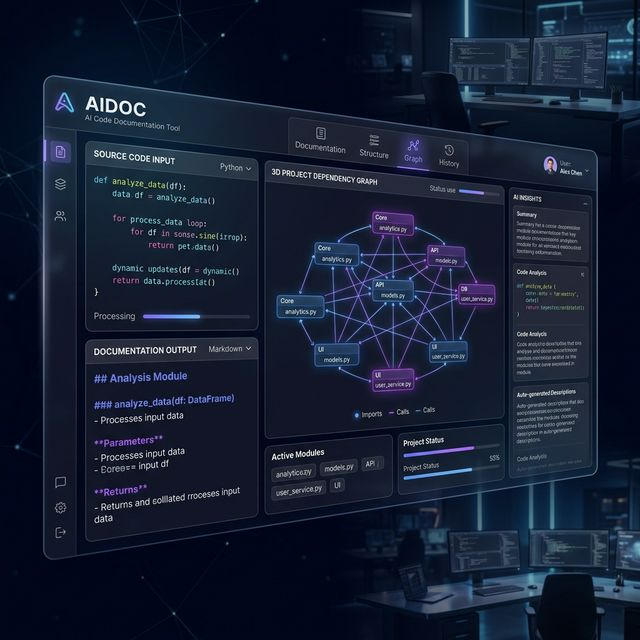

# 🤖 CodeToDoc AI



> **CodeToDoc AI: A high-performance, AI-driven documentation generator for modern codebases. It performs a deep audit of your project locally using qwen2.5-coder to produce structured Markdown documentation, interactive dependency graphs, and professional PDF reports—all while keeping your code private and secure.**

An advanced, AI-powered automated documentation generator that leverages **Local LLMs** (qwen2.5-coder) to audit, analyze, and document your projects with precision. No data leaves your machine.

---

## ✨ Key Features

### 🧠 Local Intelligence


- **Privacy First**: Uses Ollama and Qwen2.5-Coder running locally on your hardware.
- **Deep Audit**: Goes beyond docstrings; infers logic, purpose, and optimization opportunities.
- **Support**: Optimized for Python, JavaScript, and TypeScript.

### 📊 Interactive Architecture


- **Auto-Graphing**: Generates complex dependency maps using Mermaid.js.
- **Pan & Zoom**: Interactive dashboard allows exploring large codebases easily.
- **Standardized Exports**: Export documentation as clean Markdown or professional PDFs.

### 🎨 Premium Experience

- **Glassmorphism UI**: A modern, dark-themed interface designed for the next generation of developers.
- **Real-time Terminal**: Watch the AI analyze your code with a live progress feed.

---

## 🏗️ Technical Architecture

The following diagram illustrates the data flow and modular structure of the system:

```mermaid
graph TD
    A[User Upload / ZIP] --> B[FastAPI Backend (main.py)]
    B --> C[Project Scanner]
    C --> D[Language Detector]
    D --> E{File Type?}
    E -->|Python| F[Python AST Parser]
    E -->|JS/React| G[JS Pattern Parser]
    F --> H[Metadata Extractor]
    G --> H
    H --> I[Dependency & Graph Extractor]
    I --> J[AI Logic Integration (Local LLM)]
    J --> K[Markdown Generator]
    K --> L[PDF Converter]
    L --> M[Output: MD & PDF Docs]
    
    subgraph "AI Engine"
    J --- N[Ollama / qwen2.5-coder]
    end
```

---

## 🛠️ Getting Started

### Prerequisites

- **Python 3.10+**
- **Ollama** (for local AI analysis)
- **pip** (Python package manager)

### Installation

1. **Clone the repository:**

   ```bash
   git clone <repository-url>
   cd assisto-task1
   ```

2. **Install dependencies:**

   ```bash
   pip install -r code_to_doc/requirements.txt
   ```

3. **Start Ollama:**

   Ensure Ollama is running and you have pulled the required model:

   ```bash
   ollama pull qwen2.5-coder
   ```

### Running the Application

1. **Launch the FastAPI server:**

   ```bash
   python -m code_to_doc.main
   ```

2. **Access the Dashboard:**

   Open [http://localhost:8000](http://localhost:8000) in your browser.

3. **Generate Docs:**

   Upload a ZIP of your repository and click **Analyze with Local AI**.

---

## 🚀 Performance & Security

- **Parallel Processing**: Uses `ProcessPoolExecutor` to handle massive codebases (10,000+ LOC) efficiently.
- **Zero Execution**: Code is analyzed statistically using AST; it is never executed, ensuring safety against malicious scripts.
- **Local Data**: All analysis happens on-device; no proprietary code is sent to external APIs.

---

## 📝 License & Contributing

Built with ❤️ by [BytePilotManish](https://github.com/BytePilotManish).  
Feel free to open issues or pull requests to improve the documentation engine!
