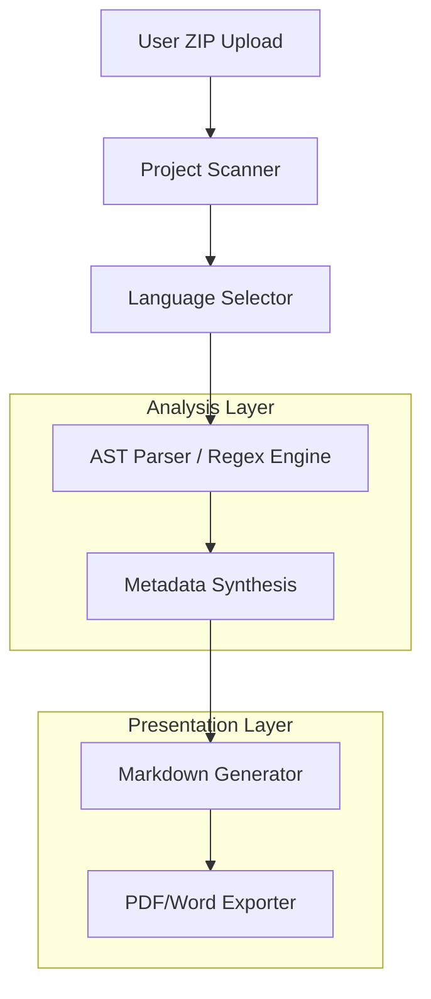

# Architecture Strategy

The system is designed as a **Static Analysis Pipeline**.

## Design Decisions

1. **AST over Regex (Python)**: We use the `ast` module for Python to ensure perfect accuracy in identifying classes and functions without executing code.
2. **Regex for JS**: For JavaScript/React, we use robust regex patterns to identify components and props, allowing for high-speed analysis across diverse JS syntaxes.
3. **Modular Extraction**: Logic for APIs and dependencies is separated into `extractors/` to allow adding new frameworks (e.g., Django, Express) easily.
4. **Multiprocessing**: Large repositories are processed in parallel using a ProcessPool to meet strict time requirements (<3 mins for 10k LOC).

## Safe Handling

- No code is executed (`eval` or `exec`).
- Zip files are extracted into unique session directories to prevent collision.
- Temporary files are (optionally) cleaned up post-analysis.
